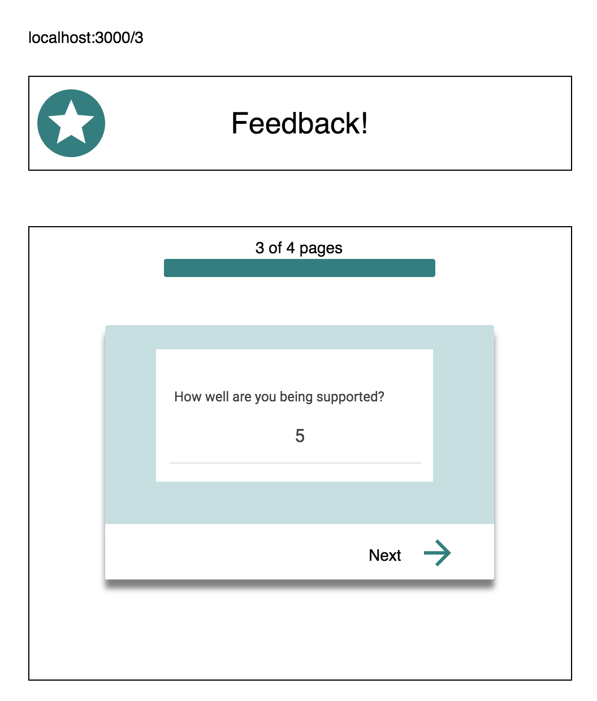
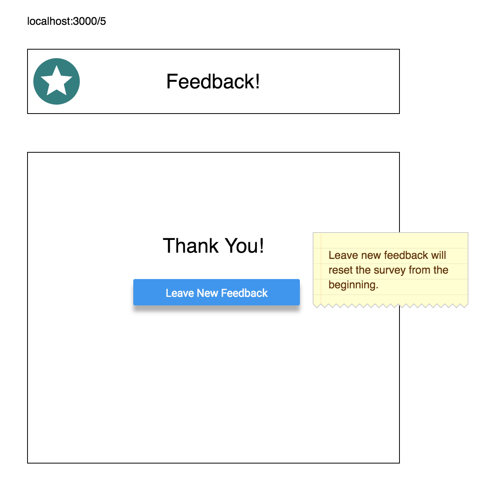

# Redux Feedback Loop

> **PLEASE COMMENT YOUR CODE.** Do not clone this repository. 

[x] Instead, download the zip, extract the contents, `git init`, `git add .`, `git commit -m "initial commit - base project"` and add your remote. Please do this before you leave for the day.

"And as always, what do I end every day with?" - Luke


 For this assignment, you will be creating a feedback form modeled after Prime's system. Feedback will be collected over 4 views, and when all steps are complete, your app will save the feedback in the database. In a separate view, a user will be able to see all the collected feedback. 

### SETUP

[x] Create your database and tables using the provided `data.sql` file. Start the server.

```
npm install
npm run server
```

[x] Now that the server is running, open a new terminal tab with `cmd + t` and start the react client app.

```
npm run client
```

### ADD NEW FEEDBACK

> NOTE: As a baseline requirement, you must use Redux to store your data across views.

[x] install node modules: body-parser, react, react redux, react-router-dom, redux, redux-logger
[x] import redux-logger
[x] set up provider and redux store
[x] set up input reducers: feeling, understanding, support, and comments
[x] create component files for feeling, understanding, support, comments, admin
[x] set up client side routing
[x] test client routes
[x] connect app
[x] feeling: prompt
[x] feeling: input
[ ] feeling: form validation
[x] feeling: connect to redux store
[x] feeling: next button functionality
[x] understanding: prompt
[x] understanding: input
[x] understanding: form validation
[x] understanding: connect to redux store
[x] understanding: next button functionality
[ ] understanding: previous button functionality
[x] support: prompt
[x] support: input
[ ] support: form validation
[x] support: connect to redux store
[x] support: next button functionality
[ ] support: previous button functionality
[x] comments: prompt
[x] comments: input
[x] comments: form validation
[x] comments: connect to redux store
[x] comments: next button functionality
[ ] comments: previous button functionality
[x] submit view: submit button runs POST to database
[x] success page
[x] admin: html setup
[x] set up adminReducer
[x] admin: GET function
[ ] admin: DELETE function
[ ] admin: DELETE confirmation
[ ] progress bar

Create a multi-part form that allows users to leave feedback for today. 
There will be 4 views for the form parts.
The parts:
- How are you feeling today?

- How well are you understanding the content?

- How well are you being supported?

- Any comments you want to leave?


While there is no nav bar, each part of the form should be at its own route. Clicking next should move the user to the appropriate step in the process.

 When the form is complete, save the submission in the database. The user should see a submission success page.
 

### DISPLAY FEEDBACK

Display all of the existing feedback at the route `/admin`. The most recently added feedback should appear at the top of the list. Allow the user to delete existing feedback. Prompt the user to confirm prior to deleting the feedback from the database.


## STRETCH GOALS

- Update this README.md to describe the project in your own words
- Improve the styling of the app using Material-UI theme, cards, snackbars, buttons, nav bar, and icons, and anything else you'd like.
- Add the ability to flag an existing feedback entry for further review on the /admin view
- Deploy your project to Heroku -- you'll need to read the special instructions for building and deploying with these apps! 


> NOTE: These stretch goals are intended to be completed in order.